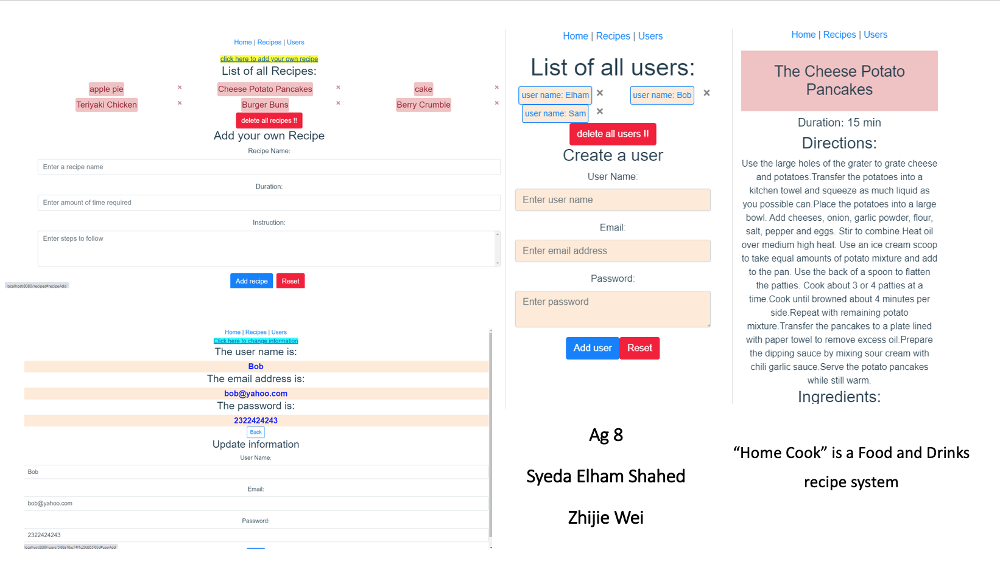

# Backend and Frontend Template

Latest version: https://git.ita.chalmers.se/courses/dit341/group-00-web (public Github [mirror](https://github.com/dit341/group-00-web))

## Project Structure

| File        | Purpose           | What you do?  |
| ------------- | ------------- | ----- |
| `server/` | Backend server code | All your server code |
| [server/README.md](server/README.md) | Everything about the server | **READ ME** carefully! |
| `client/` | Frontend client code | All your client code |
| [client/README.md](client/README.md) | Everything about the client | **READ ME** carefully! |
| [docs/DEPLOYMENT.md](docs/DEPLOYMENT.md) | Free online production deployment | Deploy your app online in production mode |
| [docs/LOCAL_DEPLOYMENT.md](docs/LOCAL_DEPLOYMENT.md) | Local production deployment | Deploy your app local in production mode |

## Requirements

The version numbers in brackets indicate the tested versions but feel free to use more recent versions.
You can also use alternative tools if you know how to configure them (e.g., Firefox instead of Chrome).

* [Git](https://git-scm.com/) (v2) => [installation instructions](https://www.atlassian.com/git/tutorials/install-git)
  * [Add your Git username and set your email](https://docs.gitlab.com/ce/gitlab-basics/start-using-git.html#add-your-git-username-and-set-your-email)
    * `git config --global user.name "YOUR_USERNAME"` => check `git config --global user.name`
    * `git config --global user.email "email@example.com"` => check `git config --global user.email`
  * > **Windows users**: We recommend to use the [Git Bash](https://www.atlassian.com/git/tutorials/git-bash) shell from your Git installation or the Bash shell from the [Windows Subsystem for Linux](https://docs.microsoft.com/en-us/windows/wsl/install-win10) to run all shell commands for this project.
* [Chalmers GitLab](https://git.ita.chalmers.se/) => Login with your **Chalmers CID** choosing "Sign in with" **Chalmers Login**. (contact [support@chalmers.se](mailto:support@chalmers.se) if you don't have one)
  * DIT341 course group: https://git.ita.chalmers.se/courses/dit341
  * [Setup SSH key with Gitlab](https://docs.gitlab.com/ee/ssh/)
    * Create an SSH key pair `ssh-keygen -t ed25519 -C "email@example.com"` (skip if you already have one)
    * Add your public SSH key to your Gitlab profile under https://git.ita.chalmers.se/profile/keys
    * Make sure the email you use to commit is registered under https://git.ita.chalmers.se/profile/emails
  * Checkout the [Backend-Frontend](https://git.ita.chalmers.se/courses/dit341/group-00-web) template `git clone git@git.ita.chalmers.se:courses/dit341/group-00-web.git`
* [Server Requirements](./server/README.md#Requirements)
* [Client Requirements](./client/README.md#Requirements)

## Getting started

```bash
# Clone repository
git clone git@git.ita.chalmers.se:courses/dit341/group-00-web.git

# Change into the directory
cd group-00-web

# Setup backend
cd server && npm install
npm run dev

# Setup frontend
cd client && npm install
npm run serve
```

> Check out the detailed instructions for [backend](./server/README.md) and [frontend](./client/README.md).

## Visual Studio Code (VSCode)

Open the `server` and `client` in separate VSCode workspaces or open the combined [backend-frontend.code-workspace](./backend-frontend.code-workspace). Otherwise, workspace-specific settings don't work properly.

## System Definition (MS0)

### Purpose

The system ‘Home Cook’ is a Food and Drinks recipe system. The user of this application can search for a recipe that uses certain ingredients and/or has a certain amount of calories in it. The user can also search by certain type of meal for example : breakfast, fika etc. The application should provide a list of recipes according to the users search criteria. 


### Pages

* Home: This page contains three search boxes for ingredients, calories and meal type. ‘Create account’ and ‘login’ buttons are also on this page but if the user is already logged in, the ‘My account’ and ‘log out’ button is displayed instead. The user can write down in the search box or select an option from a drop down list or choose to create an account or log in/out.
* Recipe List: This page contains a list of names for recipes that meets the search criteria of the user. The user can click on the recipe name. The user can save the recipe as well.
* Recipe: This page displays the recipe along with a picture, its ingredients, calorie amount and preparation time and a saving option. There is also a Review section with comment box and rating option. The user can save the recipe, give feedback by writing comments and giving a rate.
* Create Recipe: This page displays boxes to include a recipe decription to create a recipe. The user can create a recipe in this page.
* Saved Recipe: This page shows a list of recipes saved by the user and a ‘delete button’. The user can click on the recipe name and go to the recipe page and click the ‘delete button’ to delete a recipe.
* Create Account: This page displays empty boxes to fill up with users first name, last name and choose a password to create an account. The user can create an account on this page.
* My Account: This page displays the users information when logged in and a ‘Edit account’ button. Users can go to the ‘Edit account’ and ‘Saved Recipe’ page from this page.
* Edit Account: This page displays all the users information and a 'save' button.Here the user can edit and save their personal information. 


### Entity-Relationship (ER) Diagram


## Teaser (MS3)


